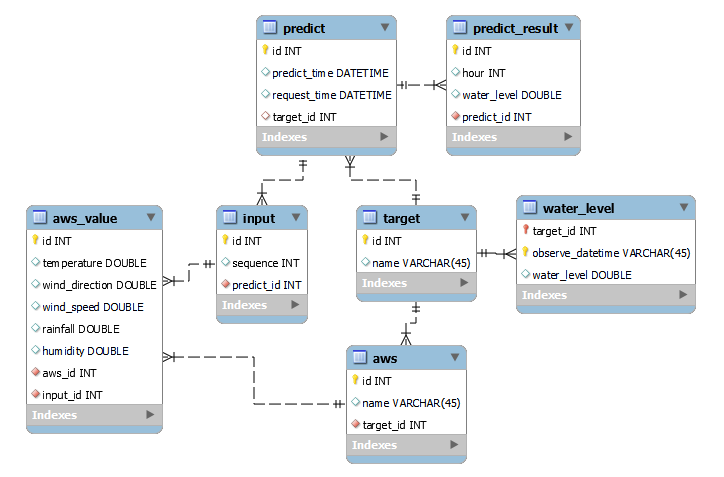

# 하천 수위 예측


## 시작하기
### Flask 서버 실행
model/predict.py 실행
### 데이터베이스 테이블 구성
data/tables
### Spring Boot 설정 파일 작성
backend/flow/src/main/resources/application.properties에 작성
```
spring.datasource.driver-class-name=com.mysql.cj.jdbc.Driver
spring.datasource.url=jdbc:mysql://localhost:3306/${your_schema}
spring.datasource.username=${your_username}
spring.datasource.password=${your_password}

spring.jpa.database-platform=org.hibernate.dialect.MySQLDialect
spring.jpa.hibernate.ddl-auto=update
spring.jpa.show-sql=true

flask.url=http://localhost:5000
fcst.service-key=${공공데이터포털_서비스_키}
fcst.url=https://apis.data.go.kr/1360000/VilageFcstInfoService_2.0/getUltraSrtFcst?serviceKey=%s&pageNo=1&numOfRows=60&dataType=JSON&base_date=%s&base_time=%s&nx=%s&ny=%s
water.url=http://www.wamis.go.kr:8080/wamis/openapi/wkw/wl_hrdata?obscd=%s&startdt=%s&output=json
```
## WebSocket
ws://localhost:8080/newpredict
## 데이터 수집
### 학습 데이터
기상자료개방포털 방재기상관측
https://data.kma.go.kr/data/grnd/selectAwsRltmList.do?pgmNo=56  
국가수자원관리종합정보시스템 수위자료
http://wamis.go.kr/wkw/wl_dubwlobs.do
### 실시간 예측 데이터
공공데이터포털 기상청 단기예보 조회
https://www.data.go.kr/tcs/dss/selectApiDataDetailView.do?publicDataPk=15084084  
국가수자원관리종합정보시스템 Open API 수위 시자료
http://www.wamis.go.kr:8080/wamisweb/wl/w8.do
## 입력
부산광역시 북구, 사상구, 사하구 기상 관측  
최근 7시간 낙동강 부산시(신평동) 수위
## 출력
1시간, 2시간, 3시간 후의 낙동강 부산시(신평동) 수위